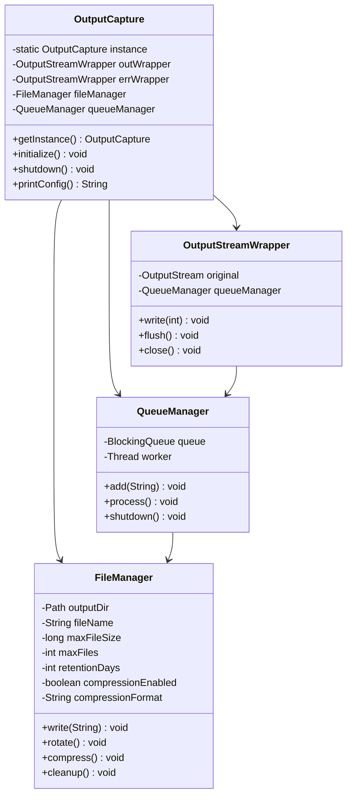

# 출력 캡처 모듈 설계 문서

## 아키텍처 개요

### 핵심 컴포넌트
1. **OutputCapture**
   - 출력 캡처 기능의 메인 클래스
   - 시스템 출력 리다이렉션 관리
   - 초기화 및 종료 처리
   - 설정 관리

2. **OutputStreamWrapper**
   - System.out과 System.err 래핑
   - 스레드 안전한 출력 처리
   - 출력 큐 관리

3. **FileManager**
   - 파일 작업 처리
   - 파일 로테이션 관리
   - 압축 제어
   - 보관 정책 관리

4. **QueueManager**
   - 출력 큐 관리
   - 비동기 쓰기 처리
   - 버퍼 크기 제어

## 클래스 다이어그램

## 설계 결정사항

### 1. 싱글톤 패턴
- **장점**
  - 단일 인스턴스로 일관된 출력 처리 보장
  - 출력 캡처에 대한 전역 접근점 제공
  - 리소스 관리 단순화

- **단점**
  - 테스트 복잡성
  - 잠재적 메모리 누수
  - 유연성 제한

### 2. 비동기 처리
- **장점**
  - 더 나은 성능
  - 비차단 출력
  - I/O 오버헤드 감소

- **단점**
  - 복잡한 오류 처리
  - 잠재적 데이터 손실
  - 메모리 사용량

### 3. 파일 관리
- **장점**
  - 체계적인 파일 관리
  - 자동 로테이션
  - 압축 및 보관 정책

- **단점**
  - 디스크 공간 관리
  - 복잡한 파일 명명
  - 잠재적 파일 시스템 문제

### 4. 설정 관리
- **장점**
  - 유연한 설정
  - 런타임 설정
  - 다중 설정 소스

- **단점**
  - 복잡한 유효성 검사
  - 잠재적 충돌
  - 문서화 오버헤드

## 성능 고려사항

### 메모리 사용
- 큐 크기 관리
- 버퍼 최적화
- 리소스 정리

### I/O 최적화
- 배치 쓰기
- 압축 전략
- 파일 시스템 캐싱

### 동시성
- 스레드 안전성
- 락 최소화
- 큐 관리

## 보안 고려사항

### 파일 접근
- 권한 관리
- 안전한 파일 생성
- 접근 제어

### 리소스 관리
- 리소스 정리
- 메모리 관리
- 파일 핸들 관리

## 확장성

### 플러그인 아키텍처
- 커스텀 출력 핸들러
- 형식 플러그인
- 저장소 플러그인

### 모니터링
- 성능 메트릭
- 리소스 사용량
- 오류 추적

## 향후 개선 계획

### 기능
- 커스텀 출력 형식
- 다중 출력 대상
- 고급 필터링

### 성능
- 향상된 압축
- 더 나은 메모리 관리
- 개선된 동시성

### 모니터링
- 실시간 메트릭
- 알림 시스템
- 상태 확인 